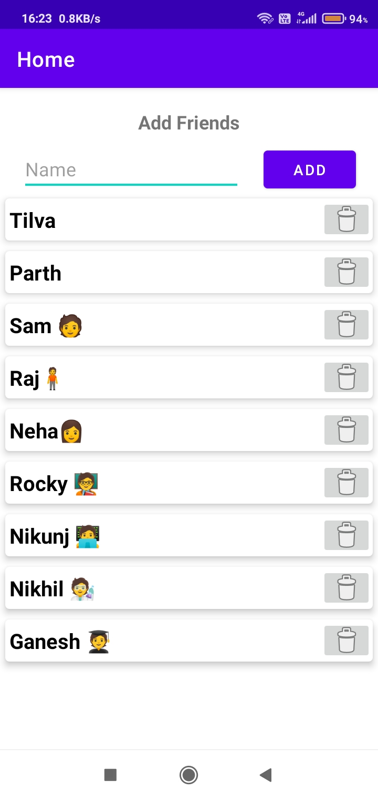
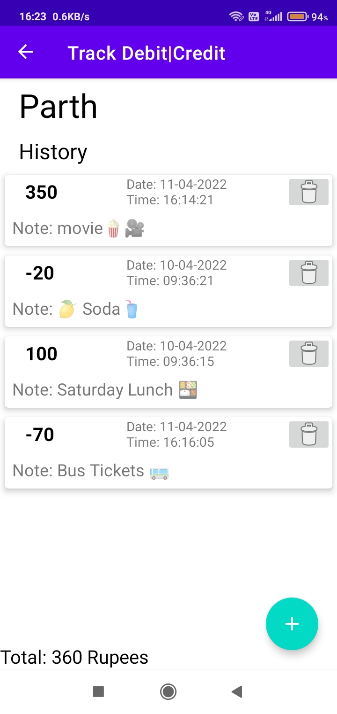
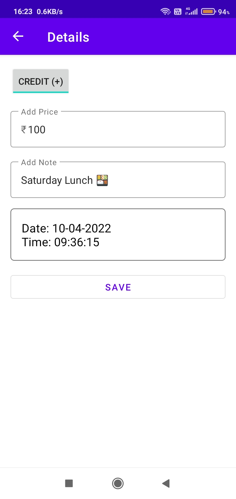

# Track-Credit-Debt
## Introduction
This is an Android application to note down debt and credit from different friends with goal to learn Room database and Jetpack's Navigation component.
#### Technologies
Android, Kotlin
#### Architecture Components
[ViewModel](https://developer.android.com/topic/libraries/architecture/viewmodel), [LiveData](https://developer.android.com/topic/libraries/architecture/livedata), [DataBinding](https://developer.android.com/topic/libraries/data-binding), 
[Navigation](https://developer.android.com/guide/navigation/)

## Features

**Add Friends:** Add friends

**Create Record:** Select debt or credit, enter amount and note 

**Edit Record:** Change amount or note

**Delete:** delete record or delete friends history

**Histroy:** History of debt and credit with friends

## Screenshots

### Home | History | Details/edit | Alert Dialog 

   
   
   
  <ima width="250" height="500" src = "git_images/alert.jpg" >

